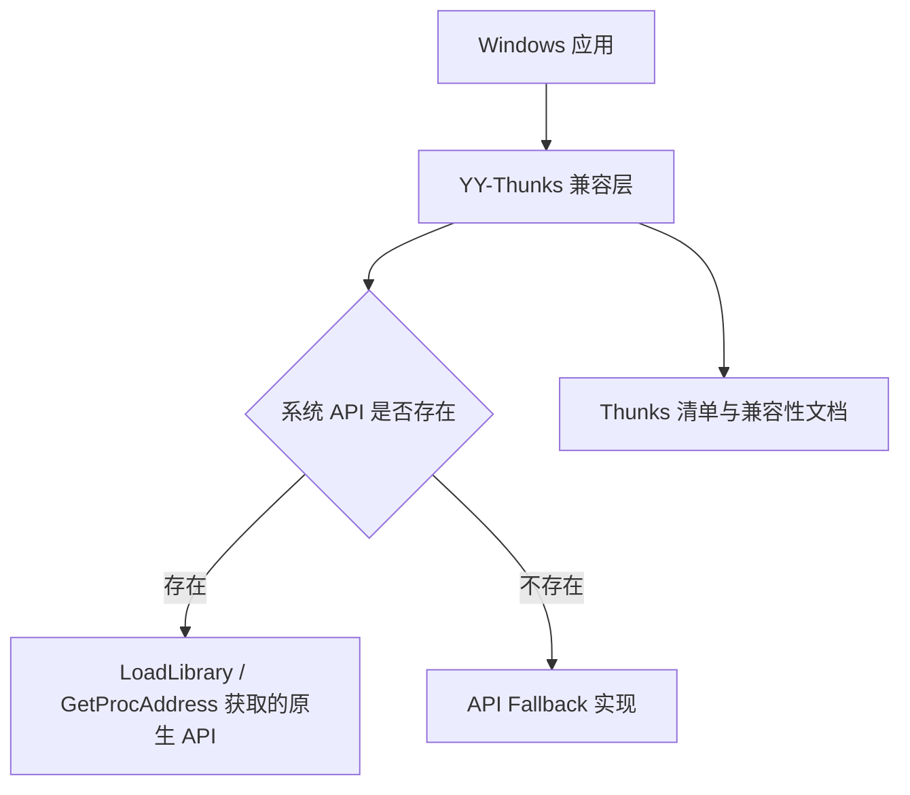
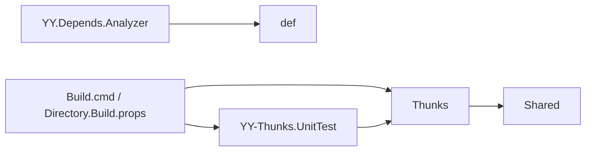

# YY-Thunks 架构总览

> 置信度说明：🔍 自动探测 | 🟡 规划中 | ✅ 已确认
> 最后更新：2026-09-18 18:13:53 +08:00

## 1. 项目概述

- 项目简介：为 Windows 应用提供缺失系统 API 的动态加载与兼容性 Fallback，帮助应用运行在较旧版本的 Windows 上。
- 核心能力：通过动态加载 API；当目标系统不存在 API 时提供兼容实现或安全的占位行为。
- 目标平台与兼容性：Windows 原生应用；工程配置覆盖 x86、x64，并以可配置的 Windows 最低版本作为兼容性基线。🔍 自动探测

## 2. 技术栈与工具链

| 类别 | 选型 | 版本 | 说明 | 置信度 |
| --- | --- | --- | --- | --- |
| 语言 | C++ | C++17（单元测试工程当前配置） | Thunks 代码需要兼容较早的编译器与运行环境 | 🔍 |
| 构建系统 | MSBuild / Visual Studio | Visual Studio 解决方案格式 12.00 | 解决方案位于 `src/YY_Thunks.sln` | 🔍 |
| 目标架构 | x86、x64 | Debug/Release | 解决方案配置为 `Debug|x86`、`Debug|x64`、`Release|x86`、`Release|x64` | 🔍 |
| 测试工程 | `YY-Thunks.UnitTest` | 原生 C++ 单元测试 | 位于 `src/YY-Thunks.UnitTest` | 🔍 |
| 辅助工具 | `MinimumRequiredVersionHelper` | 原生 C++ 工程 | 用于最低系统版本相关处理 | 🔍 |
| 分析工具 | `YY.Depends.Analyzer` | 原生 C++ 工程 | 用于依赖/API 信息分析 | 🔍 |
| 主要依赖 | Windows SDK / Visual C++ 工具链 | 由工程环境提供 | 头文件与系统库由 Visual Studio/Windows SDK 提供 | 🔍 |

## 3. 系统架构

项目采用以 API 兼容层为核心的原生 C++ 组织方式。业务应用通过链接 YY-Thunks 的目标文件或 NuGet 集成获得兼容能力；兼容层优先尝试调用系统原生 API，不存在时进入对应 Fallback。

关键文字总结：YY-Thunks 在应用与 Windows API 之间提供动态解析和按 API 划分的兼容实现，测试工程和分析工具围绕该兼容层提供验证与辅助能力。

## 4. 模块设计

| 模块 | 路径 | 职责 | 置信度 |
| --- | --- | --- | --- |
| Thunks 兼容实现 | `src/Thunks` | 按系统 DLL/API 提供动态解析和 Fallback 实现；例如 `user32.hpp` | 🔍 |
| 共享基础设施 | `src/Shared` | 提供多个 Thunks 模块复用的基础设施 | 🔍 |
| WinRT Fallback 实现 | `src/Thunks/WinRT` | 承载 `RoGetActivationFactory` 等 WinRT 相关 fallback 的具体实现，按 RuntimeClass 或相关 WinRT 能力拆分文件 | ✅ |
| 原生单元测试 | `src/YY-Thunks.UnitTest` | 验证兼容层行为和回归场景 | 🔍 |
| 最低版本辅助工具 | `src/MinimumRequiredVersionHelper` | 辅助处理最低系统版本相关信息 | 🔍 |
| 依赖分析器 | `src/YY.Depends.Analyzer` | 分析 Windows API 与依赖信息 | 🔍 |
| 构建/定义输入 | `src/def`、`src/Directory.Build.props`、`src/Build.cmd` | 提供 API 定义、共享构建属性和构建脚本 | 🔍 |
| 兼容性产物 | `src/objs` | 保存或生成面向不同目标平台的对象文件产物 | 🔍 |

模块间依赖关系：

## 5. 非功能性约束

| 类别 | 约束 | 置信度 |
| --- | --- | --- |
| 兼容性 | Thunks 实现需要面向较旧 Windows 系统和较早 C++ 编译器保持可用；实现代码避免依赖现代标准库设施 | 🔍 |
| 平台 | 至少维护 x86 与 x64 构建配置 | 🔍 |
| 性能 | 原生 API 存在时优先直接转发，减少不必要的兼容层开销 | 🔍 |
| 可靠性 | 对不具备对应系统能力的旧系统，Fallback 应提供明确的成功、失败或占位语义 | 🔍 |
| 可追溯性 | 新增 Windows API Fallback 需要同步维护 `ThunksList.md` | 🔍 |

## 6. 关键设计决策（ADR 摘要）

| 编号 | 决策 | 原因 | 影响范围 | 置信度 |
| --- | --- | --- | --- | --- |
| ADR-001 | 优先动态解析原生 API，不存在时执行 Fallback | 避免旧系统因导入表缺少 API 而无法启动，同时在新系统保留原生行为 | `src/Thunks` 全部 API 兼容模块 | 🔍 |
| ADR-002 | 按 Windows DLL 和 API 划分 Thunks 实现 | 与系统 API 边界对应，便于维护、定位和生成兼容性产物 | `src/Thunks` | 🔍 |
| ADR-003 | `RoGetActivationFactory` 的特定 RuntimeClass fallback 统一放入 `src/Thunks/WinRT/`，NuGet 配置层只负责暴露开关与构建期符号保留 | 将运行时实现与 NuGet 配置职责分离，避免 WinRT fallback 逻辑散落到非 WinRT 模块或配置层 | `src/Thunks/WinRT`、`NuGet/build` | ✅ |
| ADR-004 | 为支撑某个 Thunk，允许拦截"目标系统已存在"的通用 API（如 `CreateFileW`），但拦截仅允许做旁路处理，不得改变被拦截 API 的语义 | 部分 Thunk 需要跨进程/跨实例交换信息，而系统未提供可用通道；项目已有 `CloseHandle` / `DuplicateHandle` 先例 | `src/Thunks`、链接方性能 | 🟡 |

## 7. 跨模块契约与公共接口

- API 解析契约：每个 Fallback 优先调用对应的 `try_get_<ApiName>()` 解析结果；解析成功时转发到系统 API，解析失败时执行模块定义的兼容行为。🔍
- 工程契约：`src/YY_Thunks.sln` 统一组织单元测试、最低版本辅助工具和依赖分析器工程。🔍
- 清单契约：`ThunksList.md` 记录可用的 API Fallback 及其行为摘要。🔍
- WinRT 兼容契约：`src/Thunks/api-ms-win-core-winrt.hpp` 中的 `RoGetActivationFactory`、`RoActivateInstance` 等 API 由 WinRT/COM fallback 提供兼容行为，当前已观察到 `RoGetActivationFactory` 仅对有限接口提供本地工厂返回。🔍
- WinRT 实现边界契约：新增 `RoGetActivationFactory` RuntimeClass fallback 时，优先将具体实现放在 `src/Thunks/WinRT/` 同级目录体系下，由 WinRT 入口层统一映射；NuGet 侧仅负责构建期启用条件与符号保留。✅
- WinRT NuGet 配置能力：项目的 NuGet 集成同时包含 native 属性页扩展与 native/.NET 两套 targets，可为特定 WinRT fallback 提供配置开关，并按目标最低平台版本决定是否生效。✅
- Thunk 拦截契约：为支撑某个 Thunk 而拦截"已存在"的通用 API 时，拦截实现必须满足四项约束——（1）优先转发原生 API；（2）仅在其调用成功后做旁路处理；（3）旁路处理失败不得改变被拦截 API 的返回值与 `GetLastError`；（4）内部调用一律使用 `try_get_*` 原始指针以避免递归。🟡
- 单 TU 包含契约：所有 Thunk 头文件由 `src/Thunks/YY_Thunks_List.hpp` 聚合进同一翻译单元编译；该文件由 `YY-Thunks.UnitTest.vcxproj` 的 MSBuild 目标（`Build_YY_Thunks_List_hpp`）从 `ClInclude` 条目自动生成，顺序与登记顺序一致。头文件之间可直接跨文件调用，但被调用方必须排在调用方之前，或在使用点之前的公共头文件（如 `YY_Thunks.h`）中声明。🔍
- 管道族跨文件调用契约：为支撑 `GetNamedPipeClientProcessId` 协作，`api-ms-win-core-file.hpp` 的 `CreateFileA/W` 拦截调用管道族登记入口；因 file.hpp 在生成清单中排前，`RegisterPipeClientProcessId` / `IsLocalNamedPipePathW` / `IsLocalNamedPipePathA` 在 `YY_Thunks.h` 提前声明、在 `api-ms-win-core-namedpipe.hpp` 的 `YY_Thunks_Implemented` 块内定义；拦截实现遵循"仅旁路处理"约束（ADR-004）。🟡

## 8. 已知技术债务与限制

| 编号 | 问题 | 影响 | 计划 | 置信度 |
| --- | --- | --- | --- | --- |
| TD-001 | 部分旧系统 Fallback 只能提供占位成功或固定失败语义，无法模拟不存在的硬件/系统能力 | 调用方只能获得兼容返回值，不能获得真实系统能力 | 在 API 级文档和测试中明确行为边界 | 🔍 |
| TD-002 | 完整构建依赖正确配置的 Windows SDK/WDK 头文件环境 | 缺少系统头文件时无法构建测试工程 | 在开发环境中固定并验证所需 SDK/WDK 组件 | 🔍 |
| TD-003 | WinRT fallback 覆盖面仍有限；当前 `RoGetActivationFactory` 仅观察到 `IUIViewSettings` / `IUIViewSettingsInterop` 特判 | 新增 WinRT 兼容需求需要扩展类工厂映射、错误语义与回归测试 | 在具体 feature 中补充设计、实现与测试 | 🔍 |
| TD-004 | 命名管道对端 PID 协作机制不提供伪造防护（同会话进程可改写槽位池） | 返回的 PID 仅可作为诊断线索，不可用于安全授权判断 | 在 `ThunksList.md` 与 API 文档中显式声明，不尝试缓解 | 🟡 |
| TD-005 | 命名管道协作仅覆盖 `CreateFileW` / `CreateFileA` / `CreateNamedPipeW` / `CreateNamedPipeA`；`CallNamedPipe`、`TransactNamedPipe`、匿名管道与远程管道不参与 | 这些路径下对端 PID 查询降级为 `ERROR_NOT_SUPPORTED` | 在 `ThunksList.md` 中列为已知限制；`CallNamedPipe` 的后续实现方向已记录在 Specs §5.7，按实际需求评估排期 | 🟡 |
